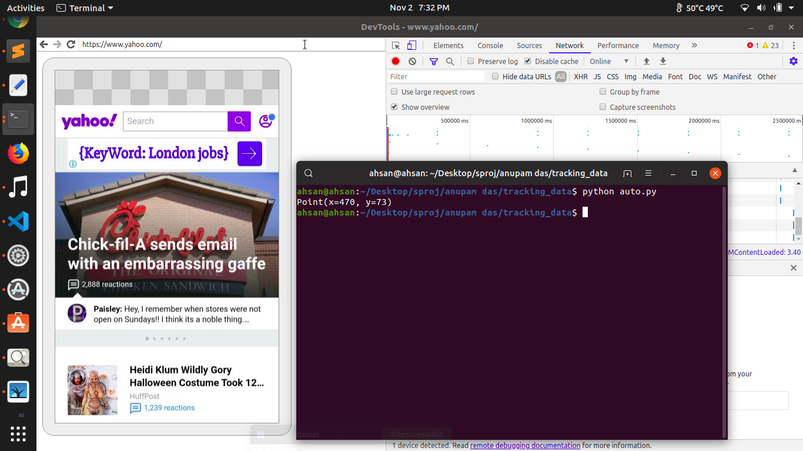

# Autologging scripts

## browser_auto.py

##### the browser_auto script is the autologging script. pyautogui library has been used to write instructions that automate clicks and keyboard hits. But for the script to work on a particular host machine, precise positions of pixels need to added to the script.

##### run_automation is the main function where the automation is happening. After each important click, a description of the task that is being performed is provided.

```
def run_automation(url_list):
    for url in url_list:
    # py.click(706,107) #clear the log ---------------> Point 5
    py.click(569,76) #click url bar ---------------> Point 1
    py.hotkey("ctrlleft","a","backspace") #clear the tab
    py.typewrite(str(url)) #enter url
    py.press("enter") #press enter
    time.sleep(wait_time) #wait for the website to load
    if scorlling == True: #perform scrolling if enabled
      py.moveTo(384,312)
      py.scroll(-30) #takes as argument number of pixels to scroll
      time.sleep(4)
    py.click(1126,101) # export the har file ---------------> Point 2
    time.sleep(1)
    py.click(159,405) #the folder where you want to save your file ---------------> Point 3
    py.sleep(2)
    py.click(1318,56) #press save button ---------------> Point 4
    time.sleep(4)
    py.click(706,107) #clear the logs ---------------> Point 5
    
```

##### As can be observed from the code above, there are five calls for click function. The arguments in each of these calls are the pixel values. The pixel values have to be exact. Below is a picture that you can use as a reference to understand where these points (pixels) are located. The arrows direct to the points for which we need exact pixel values.  


##### Once you have identified the points for which you need the pixel value, you need to retrieve exact pixel values for those points. This can be done in a trivial way using the following code (auto.py):
```
import pyautogui as py
print (py.position())
```

##### When you run this code through the terminal, it will output the position (x and y values) of the cursor wherever that cursor was positioned at the time the code was run. Below is an instance of this scenario:



##### Using this way, extract all pixel values for the points mentioned above (5 of them) and replace the values in the original file.


## Usage
#### go to the terminal and type
```
python browser_auto.py 10
```
#### the value 10 indicates the number of seconds you want to wait for the page to load before you save the har file


